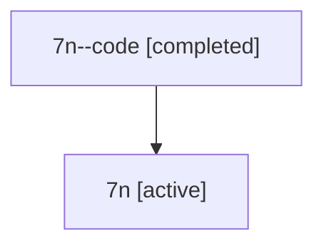

# Family: 7n

Owner: `bbugyi200.athena` · Hood: `7n` · Members: 2

## Lineage

The diagram is an optional enhancement; the ordered table below contains the same lineage in accessible text.

| Role | Agent | State | Model / provider | Timing | Commits | Prompt | Chat |
|---|---|---|---|---|---:|---|---|
| code | 7n--code | completed | gpt-5.6-sol / codex | 2026-07-13T11:44:17.567458+00:00 | 1 | — | [Chat](../agents/bbugyi200.athena.7n--code/chat.md) |
| root | 7n | active | claude-fable-5 / claude | 2026-07-13T11:32:40.110812+00:00 | 3 | [Prompt](../agents/bbugyi200.athena.7n/prompt.md) | [Chat](../agents/bbugyi200.athena.7n/chat.md) |
