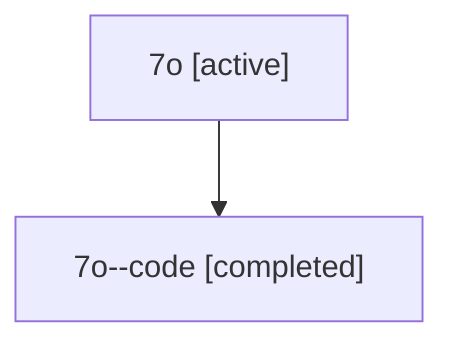

# Family: 7o

[Agent Hoods](../README.md) / [bbugyi200](../users/bbugyi200/README.md) / [athena](../users/bbugyi200/machines/athena/README.md) / [7o](../users/bbugyi200/machines/athena/hoods/7o/README.md) / 7o

Owner: `bbugyi200.athena` · Hood: `7o` · Members: 2

## Lineage

The diagram is an optional enhancement; the ordered table below contains the same lineage in accessible text.

| Role | Agent | State | Model / provider | Timing | Commits | Prompt | Chat |
|---|---|---|---|---|---:|---|---|
| root | 7o | active | gpt-5.6-sol / codex | 2026-07-13T11:37:00.056565+00:00 | [1](../agents/bbugyi200.athena.7o/README.md#commits) | [Prompt](../agents/bbugyi200.athena.7o/prompt.md) | [Chat](../agents/bbugyi200.athena.7o/chat.md) |
| code | 7o--code | completed | gpt-5.6-sol / codex | 2026-07-13T11:44:40.717457+00:00 | 0 | — | [Chat](../agents/bbugyi200.athena.7o--code/chat.md) |

## Commits

| Role | Repo | Commit | Subject | Committed |
|---|---|---|---|---|
| root | sase | [`b5a5cfb`](https://github.com/sase-org/sase/commit/b5a5cfb659b7f08ceefc7b37a858caa2f20133fe) | feat!: adopt conditional separators for derived agent IDs | 2026-07-13 08:02:34 EDT |
