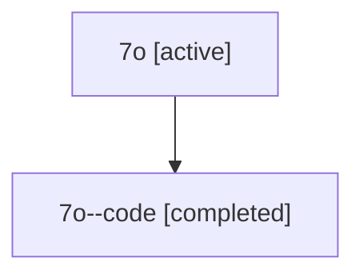

# Family: 7o

Owner: `bbugyi200.athena` · Hood: `7o` · Members: 2

## Lineage

The diagram is an optional enhancement; the ordered table below contains the same lineage in accessible text.

| Role | Agent | State | Model / provider | Timing | Commits | Prompt | Chat |
|---|---|---|---|---|---:|---|---|
| root | 7o | active | gpt-5.6-sol / codex | 2026-07-13T11:37:00.056565+00:00 | 1 | [Prompt](../agents/bbugyi200.athena.7o/prompt.md) | [Chat](../agents/bbugyi200.athena.7o/chat.md) |
| code | 7o--code | completed | gpt-5.6-sol / codex | 2026-07-13T11:44:40.717457+00:00 | 0 | — | [Chat](../agents/bbugyi200.athena.7o--code/chat.md) |
