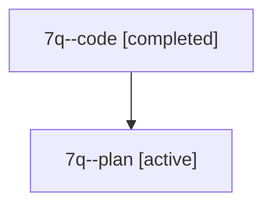

# Family: 7q

Owner: `bbugyi200.athena` · Hood: `7q` · Members: 2

## Lineage

The diagram is an optional enhancement; the ordered table below contains the same lineage in accessible text.

| Role | Agent | State | Model / provider | Timing | Commits | Prompt | Chat |
|---|---|---|---|---|---:|---|---|
| code | 7q--code | completed | gpt-5.6-sol / codex | 2026-07-13T12:42:55.487715+00:00 | 0 | — | [Chat](../agents/bbugyi200.athena.7q--code/chat.md) |
| plan | 7q--plan | active | claude-fable-5 / claude | 2026-07-13T08:32:15.203153 | 0 | [Prompt](../agents/bbugyi200.athena.7q--plan/prompt.md) | [Chat](../agents/bbugyi200.athena.7q--plan/chat.md) |
