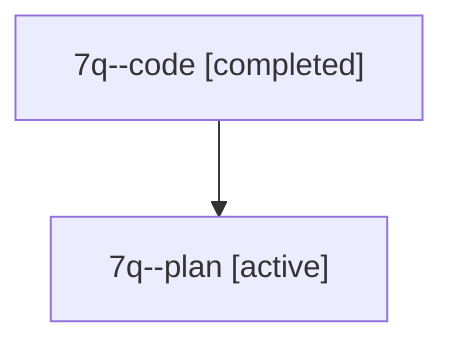

# Family: 7q

[Agent Hoods](../README.md) / [bbugyi200](../users/bbugyi200/README.md) / [athena](../users/bbugyi200/machines/athena/README.md) / [7q](../users/bbugyi200/machines/athena/hoods/7q/README.md) / 7q

Owner: `bbugyi200.athena` · Hood: `7q` · Members: 2

## Lineage

The diagram is an optional enhancement; the ordered table below contains the same lineage in accessible text.

| Role | Agent | State | Model / provider | Timing | Commits | Prompt | Chat |
|---|---|---|---|---|---:|---|---|
| code | 7q--code | completed | gpt-5.6-sol / codex | 2026-07-13T12:42:55.487715+00:00 | [1](../agents/bbugyi200.athena.7q--code/README.md#commits) | — | [Chat](../agents/bbugyi200.athena.7q--code/chat.md) |
| plan | 7q--plan | active | claude-fable-5 / claude | 2026-07-13T08:32:15.203153 | 0 | [Prompt](../agents/bbugyi200.athena.7q--plan/prompt.md) | [Chat](../agents/bbugyi200.athena.7q--plan/chat.md) |

## Commits

| Role | Repo | Commit | Subject | Committed |
|---|---|---|---|---|
| code | sase | [`33c02ed`](https://github.com/sase-org/sase/commit/33c02ed90a44096ffbf8559ad648d3ca3e9e7de1) | fix(workspace): reset repository clones before launch | 2026-07-13 09:00:41 EDT |

## Neighbors

| Agent | Relation | State |
|---|---|---|
| [7q.w0](bbugyi200.athena.7q.w0.md) (family · 2) | descendant | active 1, completed 1 |
| [7q.w1](bbugyi200.athena.7q.w1.md) (family · 2) | descendant | active 1, completed 1 |
