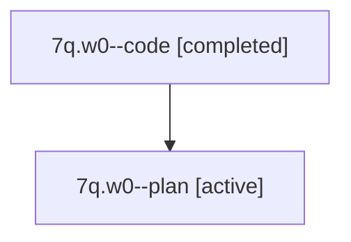

# Family: 7q.w0

Owner: `bbugyi200.athena` · Hood: `7q` · Members: 2

## Lineage

The diagram is an optional enhancement; the ordered table below contains the same lineage in accessible text.

| Role | Agent | State | Model / provider | Timing | Commits | Prompt | Chat |
|---|---|---|---|---|---:|---|---|
| code | 7q.w0--code | completed | gpt-5.6-sol / codex | 2026-07-13T13:07:59.753537+00:00 | 0 | — | [Chat](../agents/bbugyi200.athena.7q.w0--code/chat.md) |
| plan | 7q.w0--plan | active | claude-fable-5 / claude | 2026-07-13T09:01:16.587383 | 0 | [Prompt](../agents/bbugyi200.athena.7q.w0--plan/prompt.md) | [Chat](../agents/bbugyi200.athena.7q.w0--plan/chat.md) |
