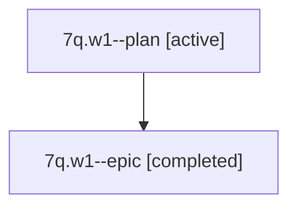

# Family: 7q.w1

Owner: `bbugyi200.athena` · Hood: `7q` · Members: 2

## Lineage

The diagram is an optional enhancement; the ordered table below contains the same lineage in accessible text.

| Role | Agent | State | Model / provider | Timing | Commits | Prompt | Chat |
|---|---|---|---|---|---:|---|---|
| plan | 7q.w1--plan | active | claude-fable-5 / claude | 2026-07-13T09:41:07.119658 | 0 | [Prompt](../agents/bbugyi200.athena.7q.w1--plan/prompt.md) | [Chat](../agents/bbugyi200.athena.7q.w1--plan/chat.md) |
| epic | 7q.w1--epic | completed | gpt-5.6-sol / codex | 2026-07-13T13:57:18.132442+00:00 | 0 | — | [Chat](../agents/bbugyi200.athena.7q.w1--epic/chat.md) |
