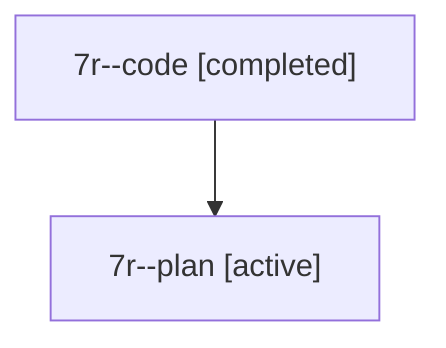

# Family: 7r

Owner: `bbugyi200.athena` · Hood: `7r` · Members: 2

## Lineage

The diagram is an optional enhancement; the ordered table below contains the same lineage in accessible text.

| Role | Agent | State | Model / provider | Timing | Commits | Prompt | Chat |
|---|---|---|---|---|---:|---|---|
| code | 7r--code | completed | gpt-5.6-sol / codex | 2026-07-13T13:07:21.793673+00:00 | 1 | — | [Chat](../agents/bbugyi200.athena.7r--code/chat.md) |
| plan | 7r--plan | active | gpt-5.6-sol / codex | 2026-07-13T09:02:02.372051 | 0 | [Prompt](../agents/bbugyi200.athena.7r--plan/prompt.md) | [Chat](../agents/bbugyi200.athena.7r--plan/chat.md) |
