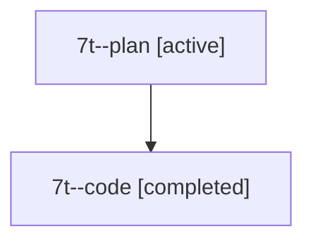

# Family: 7t

[Agent Hoods](../README.md) / [bbugyi200](../users/bbugyi200/README.md) / [athena](../users/bbugyi200/machines/athena/README.md) / [7t](../users/bbugyi200/machines/athena/hoods/7t/README.md) / 7t

Owner: `bbugyi200.athena` · Hood: `7t` · Members: 2

## Lineage

The diagram is an optional enhancement; the ordered table below contains the same lineage in accessible text.

| Role | Agent | State | Model / provider | Timing | Commits | Prompt | Chat |
|---|---|---|---|---|---:|---|---|
| plan | 7t--plan | active | claude-fable-5 / claude | 2026-07-13T09:17:38.530521 | 0 | [Prompt](../agents/bbugyi200.athena.7t--plan/prompt.md) | [Chat](../agents/bbugyi200.athena.7t--plan/chat.md) |
| code | 7t--code | completed | gpt-5.6-sol / codex | 2026-07-13T13:28:43.351576+00:00 | 0 | — | [Chat](../agents/bbugyi200.athena.7t--code/chat.md) |
