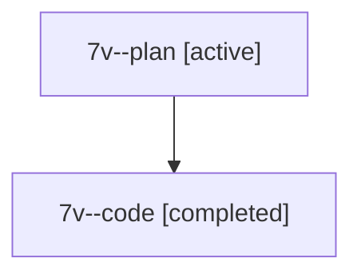

# Family: 7v

[Agent Hoods](../README.md) / [bbugyi200](../users/bbugyi200/README.md) / [athena](../users/bbugyi200/machines/athena/README.md) / [7v](../users/bbugyi200/machines/athena/hoods/7v/README.md) / 7v

Owner: `bbugyi200.athena` · Hood: `7v` · Members: 2

## Lineage

The diagram is an optional enhancement; the ordered table below contains the same lineage in accessible text.

| Role | Agent | State | Model / provider | Timing | Commits | Prompt | Chat |
|---|---|---|---|---|---:|---|---|
| plan | 7v--plan | active | gpt-5.6-sol / codex | 2026-07-13T10:21:03.865746 | 0 | [Prompt](../agents/bbugyi200.athena.7v--plan/prompt.md) | [Chat](../agents/bbugyi200.athena.7v--plan/chat.md) |
| code | 7v--code | completed | gpt-5.6-sol / codex | 2026-07-13T14:30:40.889774+00:00 | [1](../agents/bbugyi200.athena.7v--code/README.md#commits) | — | [Chat](../agents/bbugyi200.athena.7v--code/chat.md) |

## Commits

| Role | Repo | Commit | Subject | Committed |
|---|---|---|---|---|
| code | sase | [`d546a81`](https://github.com/sase-org/sase/commit/d546a813cb18d41484f7c8969156b5bed4aff941) | fix: correct runner launch admission ordering | 2026-07-13 14:52:20 UTC |
