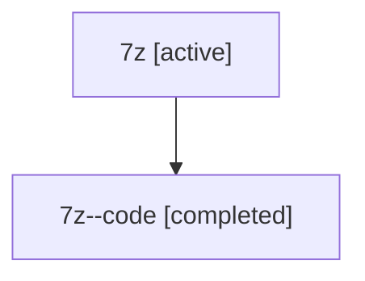

# Family: 7z

[Agent Hoods](../README.md) / [bbugyi200](../users/bbugyi200/README.md) / [athena](../users/bbugyi200/machines/athena/README.md) / [7z](../users/bbugyi200/machines/athena/hoods/7z/README.md) / 7z

Owner: `bbugyi200.athena` · Hood: `7z` · Members: 2

## Lineage

The diagram is an optional enhancement; the ordered table below contains the same lineage in accessible text.

| Role | Agent | State | Model / provider | Timing | Commits | Prompt | Chat |
|---|---|---|---|---|---:|---|---|
| root | 7z | active | claude-fable-5 / claude | 2026-07-13T15:27:08.720907+00:00 | [1](../agents/bbugyi200.athena.7z/README.md#commits) | [Prompt](../agents/bbugyi200.athena.7z/prompt.md) | [Chat](../agents/bbugyi200.athena.7z/chat.md) |
| code | 7z--code | completed | gpt-5.6-sol / codex | 2026-07-13T15:39:23.222557+00:00 | 0 | — | [Chat](../agents/bbugyi200.athena.7z--code/chat.md) |

## Commits

| Role | Commit | Subject | Committed (UTC) |
|---|---|---|---|
| root | [`0ed6b32`](https://github.com/sase-org/sase/commit/0ed6b32e49b9d31e84f26a869d41a523609256fe) | feat(xprompt): integrate epic changes before landing | 2026-07-13 15:47:20 |
