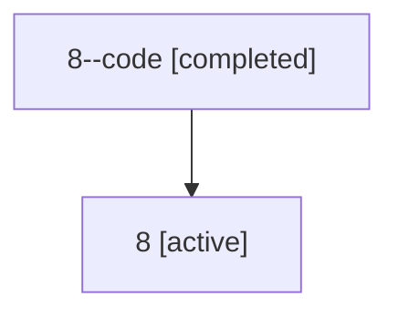

# Family: 8

[Agent Hoods](../README.md) / [bbugyi200](../users/bbugyi200/README.md) / [athena](../users/bbugyi200/machines/athena/README.md) / [8](../users/bbugyi200/machines/athena/hoods/8/README.md) / 8

Owner: `bbugyi200.athena` · Hood: `8` · Members: 2

## Lineage

The diagram is an optional enhancement; the ordered table below contains the same lineage in accessible text.

| Role | Agent | State | Model / provider | Timing | Commits | Prompt | Chat |
|---|---|---|---|---|---:|---|---|
| code | 8--code | completed | gpt-5.5 / codex | 2026-07-06T16:54:08.839555+00:00 | 0 | — | [Chat](../agents/bbugyi200.athena.8--code/chat.md) |
| root | 8 | active | claude-fable-5 / claude | 2026-07-06T16:41:31.210541+00:00 | [3](../agents/bbugyi200.athena.8/README.md#commits) | [Prompt](../agents/bbugyi200.athena.8/prompt.md) | [Chat](../agents/bbugyi200.athena.8/chat.md) |

## Commits

| Role | Repo | Commit | Subject | Committed (UTC) |
|---|---|---|---|---|
| root | sase | [`350c2a3`](https://github.com/sase-org/sase/commit/350c2a3590a780388432b5dbe1e932487257ccee) | fix: guard sase-core-rs source version skew | 2026-06-25 11:11:15 |
| root | sase | [`f493dbb`](https://github.com/sase-org/sase/commit/f493dbb99954e92c7dba93a7a0298e0367ae8393) | chore: Add SDD prompt and plan for fix\_flaky\_preview\_scroll\_test | 2026-07-06 16:54:07 |
| root | sase | [`c1475be`](https://github.com/sase-org/sase/commit/c1475bee0af886f4ca31cb53e60582df09bdd9d5) | fix(tui): make config preview scrolling deterministic | 2026-07-06 17:04:57 |
