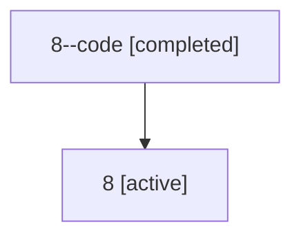

# Family: 8

Owner: `bbugyi200.athena` · Hood: `8` · Members: 2

## Lineage

The diagram is an optional enhancement; the ordered table below contains the same lineage in accessible text.

| Role | Agent | State | Model / provider | Timing | Commits | Prompt | Chat |
|---|---|---|---|---|---:|---|---|
| code | 8--code | completed | gpt-5.5 / codex | 2026-07-06T16:54:08.839555+00:00 | 0 | — | [Chat](../agents/bbugyi200.athena.8--code/chat.md) |
| root | 8 | active | claude-fable-5 / claude | 2026-07-06T16:41:31.210541+00:00 | 3 | [Prompt](../agents/bbugyi200.athena.8/prompt.md) | [Chat](../agents/bbugyi200.athena.8/chat.md) |
