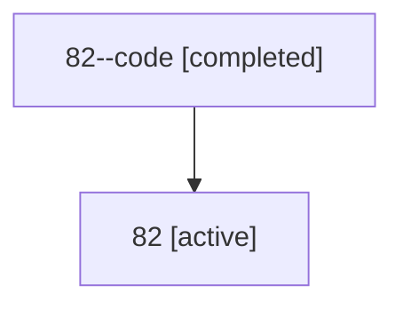

# Family: 82

[Agent Hoods](../README.md) / [bbugyi200](../users/bbugyi200/README.md) / [athena](../users/bbugyi200/machines/athena/README.md) / [82](../users/bbugyi200/machines/athena/hoods/82/README.md) / 82

Owner: `bbugyi200.athena` · Hood: `82` · Members: 2

## Lineage

The diagram is an optional enhancement; the ordered table below contains the same lineage in accessible text.

| Role | Agent | State | Model / provider | Timing | Commits | Prompt | Chat |
|---|---|---|---|---|---:|---|---|
| code | 82--code | completed | gpt-5.6-sol / codex | 2026-07-13T16:21:31.875701+00:00 | [1](../agents/bbugyi200.athena.82--code/README.md#commits) | — | [Chat](../agents/bbugyi200.athena.82--code/chat.md) |
| root | 82 | active | claude-fable-5 / claude | 2026-07-13T16:08:24.698050+00:00 | 0 | [Prompt](../agents/bbugyi200.athena.82/prompt.md) | [Chat](../agents/bbugyi200.athena.82/chat.md) |

## Commits

| Role | Repo | Commit | Subject | Committed |
|---|---|---|---|---|
| — | sase | [`6687c46`](https://github.com/sase-org/sase/commit/6687c46c165b50b5fbc51b5974d47332b727a92c) | chore: Add SDD prompt and plan for answered\_agent\_status | 2026-06-15 16:12:05 EDT |
| — | sase | [`823c4e5`](https://github.com/sase-org/sase/commit/823c4e50dafca88c3cf881b34ffda05587731ac8) | feat(ace): add transient ANSWERED agent status | 2026-06-15 16:32:48 EDT |
| code | sase | [`f7cbca6`](https://github.com/sase-org/sase/commit/f7cbca6fd4b19430d2c833d50c4ab9e5142f8b39) | fix(runner): refresh stale code after dependency waits | 2026-07-13 12:39:37 EDT |
