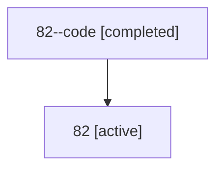

# Family: 82

Owner: `bbugyi200.athena` · Hood: `82` · Members: 2

## Lineage

The diagram is an optional enhancement; the ordered table below contains the same lineage in accessible text.

| Role | Agent | State | Model / provider | Timing | Commits | Prompt | Chat |
|---|---|---|---|---|---:|---|---|
| code | 82--code | completed | gpt-5.6-sol / codex | 2026-07-13T16:21:31.875701+00:00 | 0 | — | [Chat](../agents/bbugyi200.athena.82--code/chat.md) |
| root | 82 | active | claude-fable-5 / claude | 2026-07-13T16:08:24.698050+00:00 | 3 | [Prompt](../agents/bbugyi200.athena.82/prompt.md) | [Chat](../agents/bbugyi200.athena.82/chat.md) |
