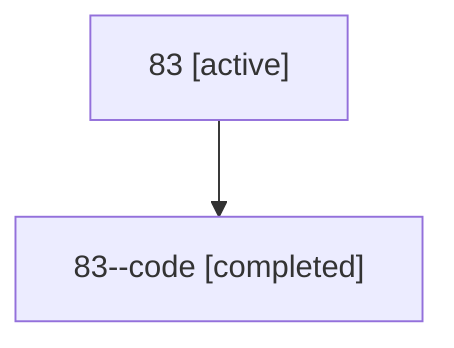

# Family: 83

[Agent Hoods](../README.md) / [bbugyi200](../users/bbugyi200/README.md) / [athena](../users/bbugyi200/machines/athena/README.md) / [83](../users/bbugyi200/machines/athena/hoods/83/README.md) / 83

Owner: `bbugyi200.athena` · Hood: `83` · Members: 2

## Lineage

The diagram is an optional enhancement; the ordered table below contains the same lineage in accessible text.

| Role | Agent | State | Model / provider | Timing | Commits | Prompt | Chat |
|---|---|---|---|---|---:|---|---|
| root | 83 | active | claude-fable-5 / claude | 2026-07-13T16:26:56.856655+00:00 | 0 | [Prompt](../agents/bbugyi200.athena.83/prompt.md) | [Chat](../agents/bbugyi200.athena.83/chat.md) |
| code | 83--code | completed | gpt-5.6-sol / codex | 2026-07-13T16:35:24.898029+00:00 | [1](../agents/bbugyi200.athena.83--code/README.md#commits) | — | [Chat](../agents/bbugyi200.athena.83--code/chat.md) |

## Commits

| Role | Repo | Commit | Subject | Committed |
|---|---|---|---|---|
| code | sase | [`a450a34`](https://github.com/sase-org/sase/commit/a450a34034d417021f83a8c8b27e415010615bbc) | fix(tui): scope group actions to focused panel | 2026-07-13 12:44:18 EDT |
