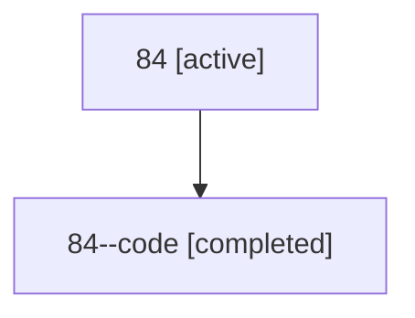

# Family: 84

[Agent Hoods](../README.md) / [bbugyi200](../users/bbugyi200/README.md) / [athena](../users/bbugyi200/machines/athena/README.md) / [84](../users/bbugyi200/machines/athena/hoods/84/README.md) / 84

Owner: `bbugyi200.athena` · Hood: `84` · Members: 2

## Lineage

The diagram is an optional enhancement; the ordered table below contains the same lineage in accessible text.

| Role | Agent | State | Model / provider | Timing | Commits | Prompt | Chat |
|---|---|---|---|---|---:|---|---|
| root | 84 | active | claude-fable-5 / claude | 2026-07-14T09:29:33.569313+00:00 | [3](../agents/bbugyi200.athena.84/README.md#commits) | [Prompt](../agents/bbugyi200.athena.84/prompt.md) | [Chat](../agents/bbugyi200.athena.84/chat.md) |
| code | 84--code | completed | gpt-5.6-sol / codex | 2026-07-14T09:57:12.469501+00:00 | 0 | — | [Chat](../agents/bbugyi200.athena.84--code/chat.md) |

## Commits

| Role | Commit | Subject | Committed (UTC) |
|---|---|---|---|
| root | [`e347407`](https://github.com/sase-org/sase/commit/e3474074c34b2b45913c7c183c8bf69386ee6bed) | chore: Add SDD prompt and plan for rename\_skills\_use | 2026-06-15 20:21:54 |
| root | [`76a7f0c`](https://github.com/sase-org/sase/commit/76a7f0c0175d8182e360397a87b504718d8cc741) | feat(skills)!: rename \`sase skills log\` to \`sase skills use\` | 2026-06-15 20:32:11 |
| root | [`36b962a`](https://github.com/sase-org/sase/commit/36b962ad9f664186dfa52b372469a9318b2c0fa7) | fix(workspaces): isolate generated SASE repo metadata | 2026-07-14 10:16:37 |

## Neighbors

| Agent | Relation | State |
|---|---|---|
| [84.f1](../agents/bbugyi200.athena.84.f1/README.md) | descendant | completed |
| [84.f2](../agents/bbugyi200.athena.84.f2/README.md) | descendant | completed |
