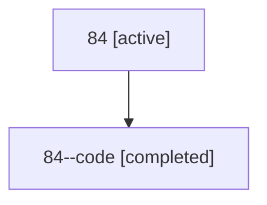

# Family: 84

Owner: `bbugyi200.athena` · Hood: `84` · Members: 2

## Lineage

The diagram is an optional enhancement; the ordered table below contains the same lineage in accessible text.

| Role | Agent | State | Model / provider | Timing | Commits | Prompt | Chat |
|---|---|---|---|---|---:|---|---|
| root | 84 | active | claude-fable-5 / claude | 2026-07-14T09:29:33.569313+00:00 | 3 | [Prompt](../agents/bbugyi200.athena.84/prompt.md) | [Chat](../agents/bbugyi200.athena.84/chat.md) |
| code | 84--code | completed | gpt-5.6-sol / codex | 2026-07-14T09:57:12.469501+00:00 | 0 | — | [Chat](../agents/bbugyi200.athena.84--code/chat.md) |
