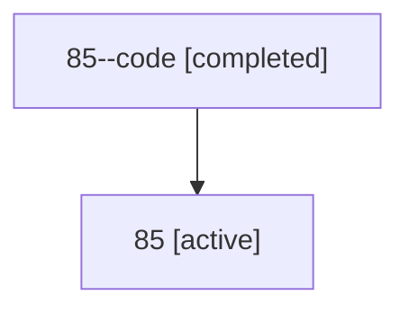

# Family: 85

Owner: `bbugyi200.athena` · Hood: `85` · Members: 2

## Lineage

The diagram is an optional enhancement; the ordered table below contains the same lineage in accessible text.

| Role | Agent | State | Model / provider | Timing | Commits | Prompt | Chat |
|---|---|---|---|---|---:|---|---|
| code | 85--code | completed | gpt-5.6-sol / codex | 2026-07-14T10:50:26.169346+00:00 | 0 | — | [Chat](../agents/bbugyi200.athena.85--code/chat.md) |
| root | 85 | active | opus / claude | 2026-07-14T10:31:34.236539+00:00 | 3 | [Prompt](../agents/bbugyi200.athena.85/prompt.md) | [Chat](../agents/bbugyi200.athena.85/chat.md) |
