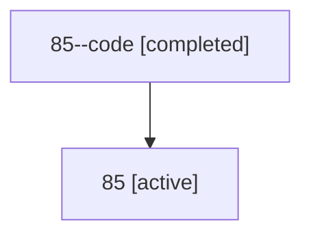

# Family: 85

[Agent Hoods](../README.md) / [bbugyi200](../users/bbugyi200/README.md) / [athena](../users/bbugyi200/machines/athena/README.md) / [85](../users/bbugyi200/machines/athena/hoods/85/README.md) / 85

Owner: `bbugyi200.athena` · Hood: `85` · Members: 2

## Lineage

The diagram is an optional enhancement; the ordered table below contains the same lineage in accessible text.

| Role | Agent | State | Model / provider | Timing | Commits | Prompt | Chat |
|---|---|---|---|---|---:|---|---|
| code | 85--code | completed | gpt-5.6-sol / codex | 2026-07-14T10:50:26.169346+00:00 | 0 | — | [Chat](../agents/bbugyi200.athena.85--code/chat.md) |
| root | 85 | active | opus / claude | 2026-07-14T10:31:34.236539+00:00 | [3](../agents/bbugyi200.athena.85/README.md#commits) | [Prompt](../agents/bbugyi200.athena.85/prompt.md) | [Chat](../agents/bbugyi200.athena.85/chat.md) |

## Commits

| Role | Commit | Subject | Committed (UTC) |
|---|---|---|---|
| root | [`6904833`](https://github.com/sase-org/sase/commit/6904833b43a7f2a4d44e222be3449d11c296fc85) | chore: Add SDD prompt and plan for rename\_skill\_command | 2026-06-15 21:01:54 |
| root | [`66d6c68`](https://github.com/sase-org/sase/commit/66d6c688c555319377ecd407ceecdadc2a135fbc) | feat(cli)!: rename \`sase skills\` command to \`sase skill\` | 2026-06-15 21:39:45 |
| root | [`b5198f7`](https://github.com/sase-org/sase/commit/b5198f7e18032c025c2a609a5fd9fbac9bbf900c) | feat(notifications): summarize agent questions in notification modal | 2026-07-14 11:10:00 |
