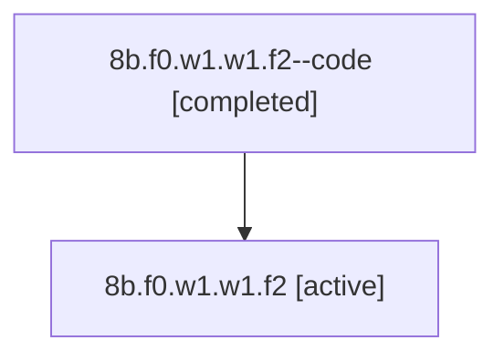

# Family: 8b.f0.w1.w1.f2

[Agent Hoods](../README.md) / [bbugyi200](../users/bbugyi200/README.md) / [athena](../users/bbugyi200/machines/athena/README.md) / [8b](../users/bbugyi200/machines/athena/hoods/8b/README.md) / 8b.f0.w1.w1.f2

Owner: `bbugyi200.athena` · Hood: `8b` · Members: 2

## Lineage

The diagram is an optional enhancement; the ordered table below contains the same lineage in accessible text.

| Role | Agent | State | Model / provider | Timing | Commits | Prompt | Chat |
|---|---|---|---|---|---:|---|---|
| code | 8b.f0.w1.w1.f2--code | completed | gpt-5.6-sol / codex | 2026-07-14T14:49:46.974367+00:00 | [1](../agents/bbugyi200.athena.8b.f0.w1.w1.f2--code/README.md#commits) | — | [Chat](../agents/bbugyi200.athena.8b.f0.w1.w1.f2--code/chat.md) |
| root | 8b.f0.w1.w1.f2 | active | opus / claude | 2026-07-14T14:36:48.508753+00:00 | 0 | [Prompt](../agents/bbugyi200.athena.8b.f0.w1.w1.f2/prompt.md) | [Chat](../agents/bbugyi200.athena.8b.f0.w1.w1.f2/chat.md) |

## Commits

| Role | Repo | Commit | Subject | Committed |
|---|---|---|---|---|
| code | sase | [`df67fec`](https://github.com/sase-org/sase/commit/df67fecb82eac898295074432b934d76a82d33b9) | feat(tui): render fenced code blocks as full-width cards | 2026-07-14 11:20:36 EDT |

## Neighbors

| Agent | Relation | State |
|---|---|---|
| [8b.f0.w1.w1](bbugyi200.athena.8b.f0.w1.w1.md) (family · 2) | ancestor | active 1, completed 1 |
| [8b.f0.w1](bbugyi200.athena.8b.f0.w1.md) (family · 2) | ancestor | active 1, completed 1 |
| [8b.f0](bbugyi200.athena.8b.f0.md) (family · 2) | ancestor | active 1, completed 1 |
| [8b](bbugyi200.athena.8b.md) (family · 2) | ancestor | active 1, completed 1 |
| [8b.f0.w1.w1.f0](../agents/bbugyi200.athena.8b.f0.w1.w1.f0/README.md) | 8b.f0.w1.w1 hood | active |
| [8b.f0.w1.w1.f1](../agents/bbugyi200.athena.8b.f0.w1.w1.f1/README.md) | 8b.f0.w1.w1 hood | active |
| [8b.f0.w1.w0](../agents/bbugyi200.athena.8b.f0.w1.w0/README.md) | 8b.f0.w1 hood | active |
| [8b.f0.w0](../agents/bbugyi200.athena.8b.f0.w0/README.md) | 8b.f0 hood | active |
| [8b.cld](../agents/bbugyi200.athena.8b.cld/README.md) | 8b hood | completed |
