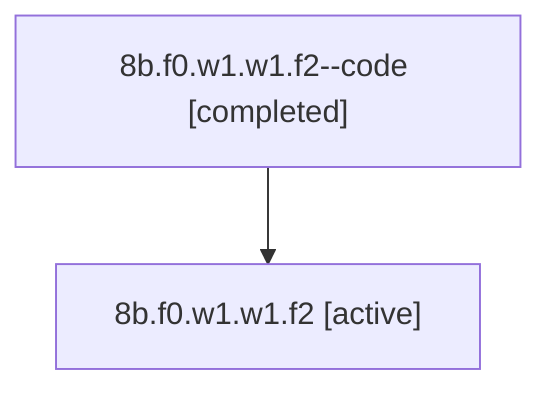

# Family: 8b.f0.w1.w1.f2

Owner: `bbugyi200.athena` · Hood: `8b` · Members: 2

## Lineage

The diagram is an optional enhancement; the ordered table below contains the same lineage in accessible text.

| Role | Agent | State | Model / provider | Timing | Commits | Prompt | Chat |
|---|---|---|---|---|---:|---|---|
| code | 8b.f0.w1.w1.f2--code | completed | gpt-5.6-sol / codex | 2026-07-14T14:49:46.974367+00:00 | 1 | — | [Chat](../agents/bbugyi200.athena.8b.f0.w1.w1.f2--code/chat.md) |
| root | 8b.f0.w1.w1.f2 | active | opus / claude | 2026-07-14T14:36:48.508753+00:00 | 1 | [Prompt](../agents/bbugyi200.athena.8b.f0.w1.w1.f2/prompt.md) | [Chat](../agents/bbugyi200.athena.8b.f0.w1.w1.f2/chat.md) |
