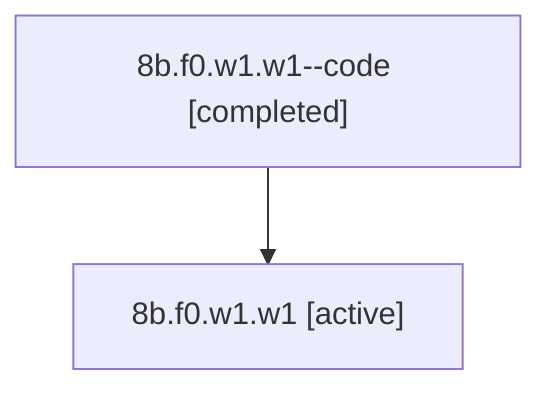

# Family: 8b.f0.w1.w1

[Agent Hoods](../README.md) / [bbugyi200](../users/bbugyi200/README.md) / [athena](../users/bbugyi200/machines/athena/README.md) / [8b](../users/bbugyi200/machines/athena/hoods/8b/README.md) / 8b.f0.w1.w1

Owner: `bbugyi200.athena` · Hood: `8b` · Members: 2

## Lineage

The diagram is an optional enhancement; the ordered table below contains the same lineage in accessible text.

| Role | Agent | State | Model / provider | Timing | Commits | Prompt | Chat |
|---|---|---|---|---|---:|---|---|
| code | 8b.f0.w1.w1--code | completed | gpt-5.6-sol / codex | 2026-07-14T13:33:43.579406+00:00 | 0 | — | [Chat](../agents/bbugyi200.athena.8b.f0.w1.w1--code/chat.md) |
| root | 8b.f0.w1.w1 | active | claude-fable-5 / claude | 2026-07-14T13:17:16.196429+00:00 | [1](../agents/bbugyi200.athena.8b.f0.w1.w1/README.md#commits) | [Prompt](../agents/bbugyi200.athena.8b.f0.w1.w1/prompt.md) | [Chat](../agents/bbugyi200.athena.8b.f0.w1.w1/chat.md) |

## Commits

| Role | Repo | Commit | Subject | Committed (UTC) |
|---|---|---|---|---|
| root | sase | [`a9813bf`](https://github.com/sase-org/sase/commit/a9813bf2c4014b6ac467476c2dcd7870436917e7) | feat: highlight literal code in prompts | 2026-07-14 14:23:19 |

## Neighbors

| Agent | Relation | State |
|---|---|---|
| [8b.f0.w1](bbugyi200.athena.8b.f0.w1.md) (family · 2) | ancestor | active 1, completed 1 |
| [8b.f0](bbugyi200.athena.8b.f0.md) (family · 2) | ancestor | active 1, completed 1 |
| [8b](bbugyi200.athena.8b.md) (family · 2) | ancestor | active 1, completed 1 |
| [8b.f0.w1.w1.f0](../agents/bbugyi200.athena.8b.f0.w1.w1.f0/README.md) | descendant | active |
| [8b.f0.w1.w1.f1](../agents/bbugyi200.athena.8b.f0.w1.w1.f1/README.md) | descendant | active |
| [8b.f0.w1.w1.f2](bbugyi200.athena.8b.f0.w1.w1.f2.md) (family · 2) | descendant | active 1, completed 1 |
| [8b.f0.w1.w0](../agents/bbugyi200.athena.8b.f0.w1.w0/README.md) | 8b.f0.w1 hood | active |
| [8b.f0.w0](../agents/bbugyi200.athena.8b.f0.w0/README.md) | 8b.f0 hood | active |
| [8b.cld](../agents/bbugyi200.athena.8b.cld/README.md) | 8b hood | completed |
