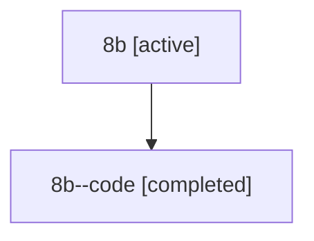

# Family: 8b

[Agent Hoods](../README.md) / [bbugyi200](../users/bbugyi200/README.md) / [athena](../users/bbugyi200/machines/athena/README.md) / [8b](../users/bbugyi200/machines/athena/hoods/8b/README.md) / 8b

Owner: `bbugyi200.athena` · Hood: `8b` · Members: 2

## Lineage

The diagram is an optional enhancement; the ordered table below contains the same lineage in accessible text.

| Role | Agent | State | Model / provider | Timing | Commits | Prompt | Chat |
|---|---|---|---|---|---:|---|---|
| root | 8b | active | opus / claude | 2026-07-14T11:16:08.648461+00:00 | [1](../agents/bbugyi200.athena.8b/README.md#commits) | [Prompt](../agents/bbugyi200.athena.8b/prompt.md) | [Chat](../agents/bbugyi200.athena.8b/chat.md) |
| code | 8b--code | completed | gpt-5.6-sol / codex | 2026-07-14T11:35:45.514076+00:00 | 0 | — | [Chat](../agents/bbugyi200.athena.8b--code/chat.md) |

## Commits

| Role | Repo | Commit | Subject | Committed |
|---|---|---|---|---|
| root | sase | [`36b0286`](https://github.com/sase-org/sase/commit/36b0286934e3ff86e1886fa50b6fb22076491453) | fix(tui): distinguish xprompt argument colors | 2026-07-14 07:48:21 EDT |

## Neighbors

| Agent | Relation | State |
|---|---|---|
| [8b.cld](../agents/bbugyi200.athena.8b.cld/README.md) | descendant | completed |
| [8b.f0](bbugyi200.athena.8b.f0.md) (family · 2) | descendant | active 1, completed 1 |
| [8b.f0.w0](../agents/bbugyi200.athena.8b.f0.w0/README.md) | descendant | active |
| [8b.f0.w1](bbugyi200.athena.8b.f0.w1.md) (family · 2) | descendant | active 1, completed 1 |
| [8b.f0.w1.w0](../agents/bbugyi200.athena.8b.f0.w1.w0/README.md) | descendant | active |
| [8b.f0.w1.w1](bbugyi200.athena.8b.f0.w1.w1.md) (family · 2) | descendant | active 1, completed 1 |
| [8b.f0.w1.w1.f0](../agents/bbugyi200.athena.8b.f0.w1.w1.f0/README.md) | descendant | active |
| [8b.f0.w1.w1.f1](../agents/bbugyi200.athena.8b.f0.w1.w1.f1/README.md) | descendant | active |
| [8b.f0.w1.w1.f2](bbugyi200.athena.8b.f0.w1.w1.f2.md) (family · 2) | descendant | active 1, completed 1 |
