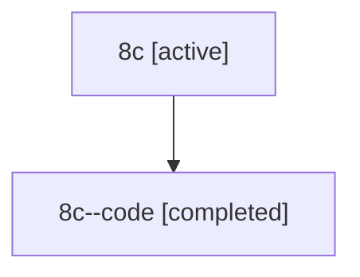

# Family: 8c

[Agent Hoods](../README.md) / [bbugyi200](../users/bbugyi200/README.md) / [athena](../users/bbugyi200/machines/athena/README.md) / [8c](../users/bbugyi200/machines/athena/hoods/8c/README.md) / 8c

Owner: `bbugyi200.athena` · Hood: `8c` · Members: 2

## Lineage

The diagram is an optional enhancement; the ordered table below contains the same lineage in accessible text.

| Role | Agent | State | Model / provider | Timing | Commits | Prompt | Chat |
|---|---|---|---|---|---:|---|---|
| root | 8c | active | claude-fable-5 / claude | 2026-07-14T11:36:41.812896+00:00 | 0 | [Prompt](../agents/bbugyi200.athena.8c/prompt.md) | [Chat](../agents/bbugyi200.athena.8c/chat.md) |
| code | 8c--code | completed | gpt-5.6-sol / codex | 2026-07-14T11:51:38.935862+00:00 | [1](../agents/bbugyi200.athena.8c--code/README.md#commits) | — | [Chat](../agents/bbugyi200.athena.8c--code/chat.md) |

## Commits

| Role | Repo | Commit | Subject | Committed |
|---|---|---|---|---|
| — | sase | [`df33735`](https://github.com/sase-org/sase/commit/df33735794b28f5d898a6cfeb21b6cc9ca3f693e) | chore: Add SDD prompt and plan for live\_agent\_pencil | 2026-06-15 19:03:37 EDT |
| — | sase | [`9148408`](https://github.com/sase-org/sase/commit/91484084ba7d66c81b28b3e347610fcf236a0a85) | feat(ace): show pencil badge for live agent workspace edits | 2026-06-15 19:25:19 EDT |
| code | sase | [`5bd4014`](https://github.com/sase-org/sase/commit/5bd40142d85b2071e157343a15bf7f401503085e) | fix(artifacts): attribute attachments to commit repositories | 2026-07-14 08:03:03 EDT |
