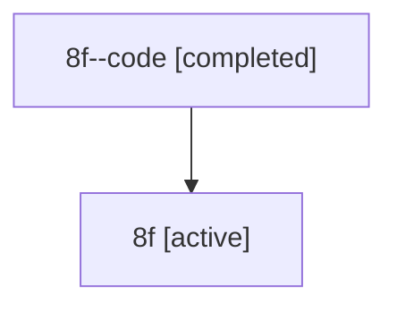

# Family: 8f

Owner: `bbugyi200.athena` · Hood: `8f` · Members: 2

## Lineage

The diagram is an optional enhancement; the ordered table below contains the same lineage in accessible text.

| Role | Agent | State | Model / provider | Timing | Commits | Prompt | Chat |
|---|---|---|---|---|---:|---|---|
| code | 8f--code | completed | gpt-5.6-sol / codex | 2026-07-14T12:55:45.583058+00:00 | 0 | — | [Chat](../agents/bbugyi200.athena.8f--code/chat.md) |
| root | 8f | active | claude-fable-5 / claude | 2026-07-14T12:24:29.468328+00:00 | 3 | [Prompt](../agents/bbugyi200.athena.8f/prompt.md) | [Chat](../agents/bbugyi200.athena.8f/chat.md) |
