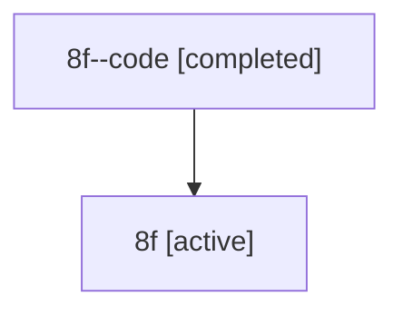

# Family: 8f

[Agent Hoods](../README.md) / [bbugyi200](../users/bbugyi200/README.md) / [athena](../users/bbugyi200/machines/athena/README.md) / [8f](../users/bbugyi200/machines/athena/hoods/8f/README.md) / 8f

Owner: `bbugyi200.athena` · Hood: `8f` · Members: 2

## Lineage

The diagram is an optional enhancement; the ordered table below contains the same lineage in accessible text.

| Role | Agent | State | Model / provider | Timing | Commits | Prompt | Chat |
|---|---|---|---|---|---:|---|---|
| code | 8f--code | completed | gpt-5.6-sol / codex | 2026-07-14T12:55:45.583058+00:00 | 0 | — | [Chat](../agents/bbugyi200.athena.8f--code/chat.md) |
| root | 8f | active | claude-fable-5 / claude | 2026-07-14T12:24:29.468328+00:00 | [3](../agents/bbugyi200.athena.8f/README.md#commits) | [Prompt](../agents/bbugyi200.athena.8f/prompt.md) | [Chat](../agents/bbugyi200.athena.8f/chat.md) |

## Commits

| Role | Repo | Commit | Subject | Committed (UTC) |
|---|---|---|---|---|
| root | sase | [`e20f51f`](https://github.com/sase-org/sase/commit/e20f51f7ffb6d8a63aaf07a2b8a5b084a4eea047) | chore: Add SDD prompt and plan for remove\_memory\_episodes | 2026-06-15 23:42:22 |
| root | sase | [`37973b8`](https://github.com/sase-org/sase/commit/37973b8b3faa00322d218bd819e8b3e4e9d2bce5) | feat(memory)!: remove the memory episodes feature | 2026-06-16 00:16:42 |
| root | sase | [`fef304c`](https://github.com/sase-org/sase/commit/fef304cfaa2c810b82e1acb842ca6c554a1562a9) | fix(ace): prepare project reverts on default branches | 2026-07-14 13:04:35 |
