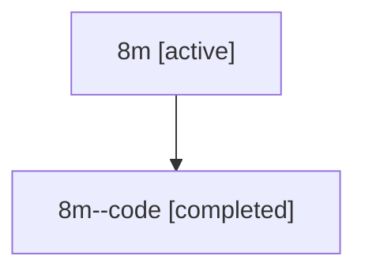

# Family: 8m

Owner: `bbugyi200.athena` · Hood: `8m` · Members: 2

## Lineage

The diagram is an optional enhancement; the ordered table below contains the same lineage in accessible text.

| Role | Agent | State | Model / provider | Timing | Commits | Prompt | Chat |
|---|---|---|---|---|---:|---|---|
| root | 8m | active | gpt-5.6-sol / codex | 2026-07-14T13:35:33.681641+00:00 | 3 | [Prompt](../agents/bbugyi200.athena.8m/prompt.md) | [Chat](../agents/bbugyi200.athena.8m/chat.md) |
| code | 8m--code | completed | gpt-5.6-sol / codex | 2026-07-14T13:41:56.101629+00:00 | 1 | — | [Chat](../agents/bbugyi200.athena.8m--code/chat.md) |
