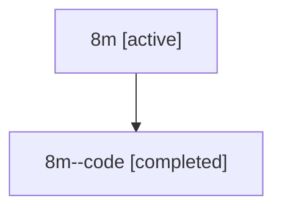

# Family: 8m

[Agent Hoods](../README.md) / [bbugyi200](../users/bbugyi200/README.md) / [athena](../users/bbugyi200/machines/athena/README.md) / [8m](../users/bbugyi200/machines/athena/hoods/8m/README.md) / 8m

Owner: `bbugyi200.athena` · Hood: `8m` · Members: 2

## Lineage

The diagram is an optional enhancement; the ordered table below contains the same lineage in accessible text.

| Role | Agent | State | Model / provider | Timing | Commits | Prompt | Chat |
|---|---|---|---|---|---:|---|---|
| root | 8m | active | gpt-5.6-sol / codex | 2026-07-14T13:35:33.681641+00:00 | [3](../agents/bbugyi200.athena.8m/README.md#commits) | [Prompt](../agents/bbugyi200.athena.8m/prompt.md) | [Chat](../agents/bbugyi200.athena.8m/chat.md) |
| code | 8m--code | completed | gpt-5.6-sol / codex | 2026-07-14T13:41:56.101629+00:00 | [1](../agents/bbugyi200.athena.8m--code/README.md#commits) | — | [Chat](../agents/bbugyi200.athena.8m--code/chat.md) |

## Commits

| Role | Repo | Commit | Subject | Committed |
|---|---|---|---|---|
| root | sase | [`cbb50de`](https://github.com/sase-org/sase/commit/cbb50de611d7b0486cda8ec0bac81202ee702a49) | chore: Add SDD prompt and plan for prompt\_stash | 2026-06-15 22:07:05 EDT |
| root | sase | [`7dac5bb`](https://github.com/sase-org/sase/commit/7dac5bbd5ecd3455909a95182c5bc0c104f51694) | chore: create prompt stash epic beads | 2026-06-15 22:22:05 EDT |
| code | sase | [`81eca4e`](https://github.com/sase-org/sase/commit/81eca4e6663478ea9d7cec34594d2ad43cc057c1) | fix(ace): scope group folds to agent panels | 2026-07-14 10:07:18 EDT |
| root | sase | [`81eca4e`](https://github.com/sase-org/sase/commit/81eca4e6663478ea9d7cec34594d2ad43cc057c1) | fix(ace): scope group folds to agent panels | 2026-07-14 10:07:18 EDT |
