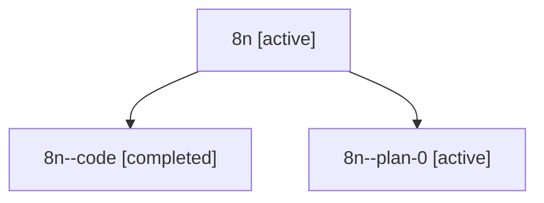

# Family: 8n

[Agent Hoods](../README.md) / [bbugyi200](../users/bbugyi200/README.md) / [athena](../users/bbugyi200/machines/athena/README.md) / [8n](../users/bbugyi200/machines/athena/hoods/8n/README.md) / 8n

Owner: `bbugyi200.athena` · Hood: `8n` · Members: 3

## Lineage

The diagram is an optional enhancement; the ordered table below contains the same lineage in accessible text.

| Role | Agent | State | Model / provider | Timing | Commits | Prompt | Chat |
|---|---|---|---|---|---:|---|---|
| root | 8n | active | gpt-5.6-sol / codex | 2026-07-14T15:11:59.584287+00:00 | [1](../agents/bbugyi200.athena.8n/README.md#commits) | [Prompt](../agents/bbugyi200.athena.8n/prompt.md) | [Chat](../agents/bbugyi200.athena.8n/chat.md) |
| code | 8n--code | completed | gpt-5.6-sol / codex | 2026-07-14T15:24:02.251878+00:00 | [1](../agents/bbugyi200.athena.8n--code/README.md#commits) | — | [Chat](../agents/bbugyi200.athena.8n--code/chat.md) |
| plan-0 | 8n--plan-0 | active | gpt-5.6-sol / codex | 2026-07-14T15:18:43.006901+00:00 | 0 | — | [Chat](../agents/bbugyi200.athena.8n--plan-0/chat.md) |

## Commits

| Role | Repo | Commit | Subject | Committed |
|---|---|---|---|---|
| code | sase | [`05ef506`](https://github.com/sase-org/sase/commit/05ef5069984b6a42023bb565411e58cb677c4934) | fix(tui): preserve agent names in bulk kill-and-edit | 2026-07-14 11:38:51 EDT |
| root | sase | [`05ef506`](https://github.com/sase-org/sase/commit/05ef5069984b6a42023bb565411e58cb677c4934) | fix(tui): preserve agent names in bulk kill-and-edit | 2026-07-14 11:38:51 EDT |
