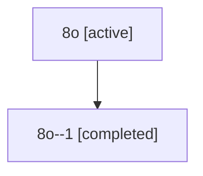

# Family: 8o

Owner: `bbugyi200.athena` · Hood: `8o` · Members: 2

## Lineage

The diagram is an optional enhancement; the ordered table below contains the same lineage in accessible text.

| Role | Agent | State | Model / provider | Timing | Commits | Prompt | Chat |
|---|---|---|---|---|---:|---|---|
| root | 8o | active | gpt-5.6-sol / codex | 2026-07-14T15:17:22.698284+00:00 | 0 | [Prompt](../agents/bbugyi200.athena.8o/prompt.md) | [Chat](../agents/bbugyi200.athena.8o/chat.md) |
| 1 | 8o--1 | completed | gpt-5.6-sol / codex | 2026-07-14T15:34:45.722572+00:00 | 0 | — | [Chat](../agents/bbugyi200.athena.8o--1/chat.md) |
