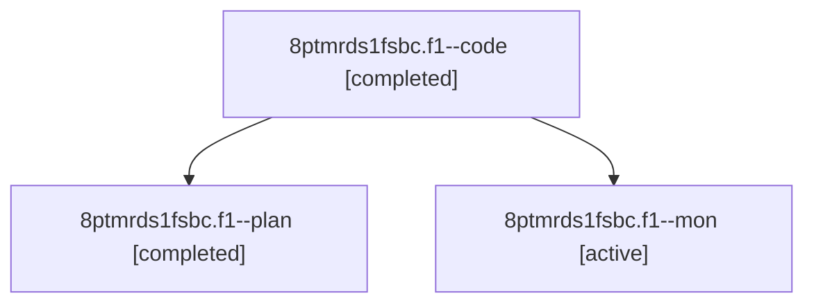

# Family: 8ptmrds1fsbc.f1

[Agent Hoods](../README.md) / [bbugyi200](../users/bbugyi200/README.md) / [athena](../users/bbugyi200/machines/athena/README.md) / [8ptmrds1fsbc](../users/bbugyi200/machines/athena/hoods/8ptmrds1fsbc/README.md) / 8ptmrds1fsbc.f1

Owner: `bbugyi200.athena` · Hood: `8ptmrds1fsbc` · Members: 3

## Lineage

The diagram is an optional enhancement; the ordered table below contains the same lineage in accessible text.

| Role | Agent | State | Model / provider | Timing | Commits | Prompt | Chat |
|---|---|---|---|---|---:|---|---|
| code | 8ptmrds1fsbc.f1--code | completed | gpt-5.5 / codex | 2026-08-25T19:19:56.279345+00:00 → 2026-08-25T19:30:57.439809+00:00 | 0 | — | [Chat](../agents/bbugyi200.athena.8ptmrds1fsbc.f1--code/chat.md) |
| plan | 8ptmrds1fsbc.f1--plan | completed | opus / claude | 2026-08-25T18:41:12.516833+00:00 → 2026-08-25T19:30:57.439809+00:00 | 0 | [Prompt](../agents/bbugyi200.athena.8ptmrds1fsbc.f1--plan/prompt.md) | [Chat](../agents/bbugyi200.athena.8ptmrds1fsbc.f1--plan/chat.md) |
| mon | 8ptmrds1fsbc.f1--mon | active | gpt-5.5 / codex | 2026-08-25T19:30:45.864576+00:00 | 0 | — | — |
