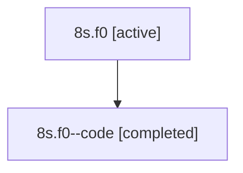

# Family: 8s.f0

[Agent Hoods](../README.md) / [bbugyi200](../users/bbugyi200/README.md) / [athena](../users/bbugyi200/machines/athena/README.md) / [8s](../users/bbugyi200/machines/athena/hoods/8s/README.md) / 8s.f0

Owner: `bbugyi200.athena` · Hood: `8s` · Members: 2

## Lineage

The diagram is an optional enhancement; the ordered table below contains the same lineage in accessible text.

| Role | Agent | State | Model / provider | Timing | Commits | Prompt | Chat |
|---|---|---|---|---|---:|---|---|
| root | 8s.f0 | active | gpt-5.6-sol / codex | 2026-07-15T13:04:32.073083+00:00 | [1](../agents/bbugyi200.athena.8s.f0/README.md#commits) | [Prompt](../agents/bbugyi200.athena.8s.f0/prompt.md) | [Chat](../agents/bbugyi200.athena.8s.f0/chat.md) |
| code | 8s.f0--code | completed | gpt-5.6-sol / codex | 2026-07-15T13:11:18.593545+00:00 | [1](../agents/bbugyi200.athena.8s.f0--code/README.md#commits) | — | [Chat](../agents/bbugyi200.athena.8s.f0--code/chat.md) |

## Commits

| Role | Repo | Commit | Subject | Committed |
|---|---|---|---|---|
| code | sase | [`2394f83`](https://github.com/sase-org/sase/commit/2394f83054581ff1babff2b03fd97f3618c1f1cd) | feat(ace): render complete responsive plan goals | 2026-07-15 09:39:10 EDT |
| root | sase | [`2394f83`](https://github.com/sase-org/sase/commit/2394f83054581ff1babff2b03fd97f3618c1f1cd) | feat(ace): render complete responsive plan goals | 2026-07-15 09:39:10 EDT |

## Neighbors

| Agent | Relation | State |
|---|---|---|
| [8s](bbugyi200.athena.8s.md) (family · 2) | ancestor | active 1, completed 1 |
