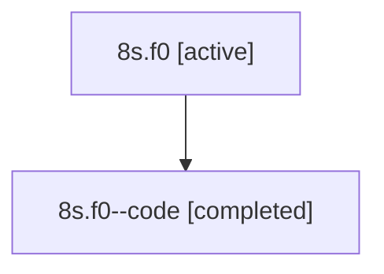

# Family: 8s.f0

Owner: `bbugyi200.athena` · Hood: `8s` · Members: 2

## Lineage

The diagram is an optional enhancement; the ordered table below contains the same lineage in accessible text.

| Role | Agent | State | Model / provider | Timing | Commits | Prompt | Chat |
|---|---|---|---|---|---:|---|---|
| root | 8s.f0 | active | gpt-5.6-sol / codex | 2026-07-15T13:04:32.073083+00:00 | 1 | [Prompt](../agents/bbugyi200.athena.8s.f0/prompt.md) | [Chat](../agents/bbugyi200.athena.8s.f0/chat.md) |
| code | 8s.f0--code | completed | gpt-5.6-sol / codex | 2026-07-15T13:11:18.593545+00:00 | 1 | — | [Chat](../agents/bbugyi200.athena.8s.f0--code/chat.md) |
