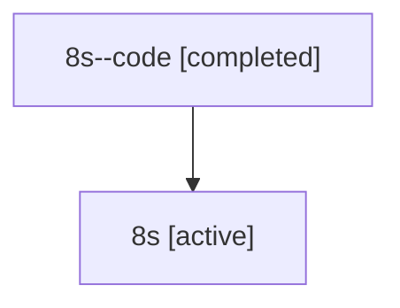

# Family: 8s

[Agent Hoods](../README.md) / [bbugyi200](../users/bbugyi200/README.md) / [athena](../users/bbugyi200/machines/athena/README.md) / [8s](../users/bbugyi200/machines/athena/hoods/8s/README.md) / 8s

Owner: `bbugyi200.athena` · Hood: `8s` · Members: 2

## Lineage

The diagram is an optional enhancement; the ordered table below contains the same lineage in accessible text.

| Role | Agent | State | Model / provider | Timing | Commits | Prompt | Chat |
|---|---|---|---|---|---:|---|---|
| code | 8s--code | completed | gpt-5.6-sol / codex | 2026-07-15T12:13:17.381057+00:00 | [1](../agents/bbugyi200.athena.8s--code/README.md#commits) | — | [Chat](../agents/bbugyi200.athena.8s--code/chat.md) |
| root | 8s | active | opus / claude | 2026-07-15T12:00:37.242528+00:00 | 0 | [Prompt](../agents/bbugyi200.athena.8s/prompt.md) | [Chat](../agents/bbugyi200.athena.8s/chat.md) |

## Commits

| Role | Repo | Commit | Subject | Committed |
|---|---|---|---|---|
| code | sase | [`5ac12cc`](https://github.com/sase-org/sase/commit/5ac12ccff8c0a8aa145b373703975aef37952c28) | feat(ace): show associated plan goals in agent details | 2026-07-15 08:40:18 EDT |

## Neighbors

| Agent | Relation | State |
|---|---|---|
| [8s.f0](bbugyi200.athena.8s.f0.md) (family · 2) | descendant | active 1, completed 1 |
