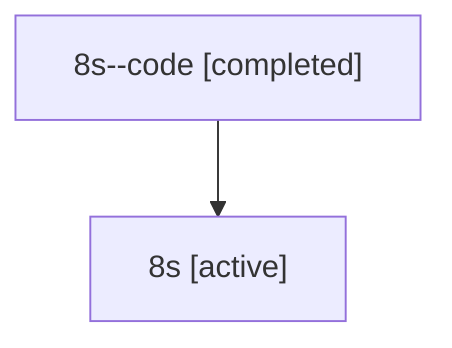

# Family: 8s

Owner: `bbugyi200.athena` · Hood: `8s` · Members: 2

## Lineage

The diagram is an optional enhancement; the ordered table below contains the same lineage in accessible text.

| Role | Agent | State | Model / provider | Timing | Commits | Prompt | Chat |
|---|---|---|---|---|---:|---|---|
| code | 8s--code | completed | gpt-5.6-sol / codex | 2026-07-15T12:13:17.381057+00:00 | 0 | — | [Chat](../agents/bbugyi200.athena.8s--code/chat.md) |
| root | 8s | active | opus / claude | 2026-07-15T12:00:37.242528+00:00 | 1 | [Prompt](../agents/bbugyi200.athena.8s/prompt.md) | [Chat](../agents/bbugyi200.athena.8s/chat.md) |
