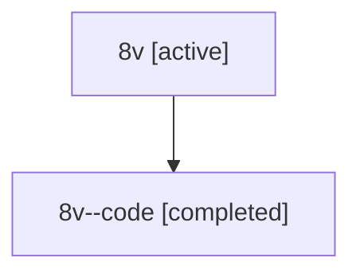

# Family: 8v

[Agent Hoods](../README.md) / [bbugyi200](../users/bbugyi200/README.md) / [athena](../users/bbugyi200/machines/athena/README.md) / [8v](../users/bbugyi200/machines/athena/hoods/8v/README.md) / 8v

Owner: `bbugyi200.athena` · Hood: `8v` · Members: 2

## Lineage

The diagram is an optional enhancement; the ordered table below contains the same lineage in accessible text.

| Role | Agent | State | Model / provider | Timing | Commits | Prompt | Chat |
|---|---|---|---|---|---:|---|---|
| root | 8v | active | gpt-5.6-sol / codex | 2026-07-15T12:17:57.012277+00:00 | [1](../agents/bbugyi200.athena.8v/README.md#commits) | [Prompt](../agents/bbugyi200.athena.8v/prompt.md) | [Chat](../agents/bbugyi200.athena.8v/chat.md) |
| code | 8v--code | completed | gpt-5.6-sol / codex | 2026-07-15T12:22:29.699714+00:00 | [1](../agents/bbugyi200.athena.8v--code/README.md#commits) | — | [Chat](../agents/bbugyi200.athena.8v--code/chat.md) |

## Commits

| Role | Commit | Subject | Committed (UTC) |
|---|---|---|---|
| code | [`1114961`](https://github.com/sase-org/sase/commit/1114961b46c4374c6d9c291cce0a1b8aab79b638) | build: prefer workspace-local sase-core checkout | 2026-07-15 12:40:03 |
| root | [`1114961`](https://github.com/sase-org/sase/commit/1114961b46c4374c6d9c291cce0a1b8aab79b638) | build: prefer workspace-local sase-core checkout | 2026-07-15 12:40:03 |
