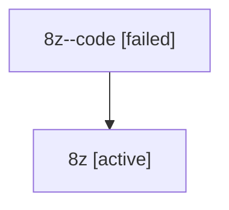

# Family: 8z

[Agent Hoods](../README.md) / [bbugyi200](../users/bbugyi200/README.md) / [athena](../users/bbugyi200/machines/athena/README.md) / [8z](../users/bbugyi200/machines/athena/hoods/8z/README.md) / 8z

Owner: `bbugyi200.athena` · Hood: `8z` · Members: 2

## Lineage

The diagram is an optional enhancement; the ordered table below contains the same lineage in accessible text.

| Role | Agent | State | Model / provider | Timing | Commits | Prompt | Chat |
|---|---|---|---|---|---:|---|---|
| code | 8z--code | failed | gpt-5.6-sol / codex | 2026-07-15T13:01:18.872793+00:00 | [1](../agents/bbugyi200.athena.8z--code/README.md#commits) | — | — |
| root | 8z | active | gpt-5.6-sol / codex | 2026-07-15T12:58:01.075689+00:00 | 0 | [Prompt](../agents/bbugyi200.athena.8z/prompt.md) | [Chat](../agents/bbugyi200.athena.8z/chat.md) |

## Commits

| Role | Repo | Commit | Subject | Committed |
|---|---|---|---|---|
| — | sase | [`391043f`](https://github.com/sase-org/sase/commit/391043fe4bb8d7cbb427584e1ff469249465dd8f) | chore: Add SDD prompt and plan for xprompts\_metadata\_field | 2026-06-16 18:08:36 UTC |
| — | sase | [`0374375`](https://github.com/sase-org/sase/commit/03743757ac53eb5bb4eecdcce271724061a754f9) | feat: capture xprompt usage metadata | 2026-06-16 18:31:17 UTC |
| code | sase | [`ea38782`](https://github.com/sase-org/sase/commit/ea387821a77118ac2450a746950f1e6cbb8ac36c) | fix: display configured project names in plan inventory | 2026-07-15 13:10:11 UTC |
