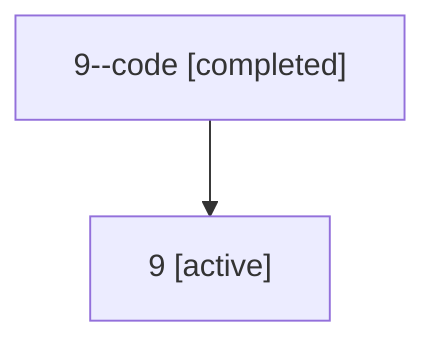

# Family: 9

[Agent Hoods](../README.md) / [bbugyi200](../users/bbugyi200/README.md) / [athena](../users/bbugyi200/machines/athena/README.md) / [9](../users/bbugyi200/machines/athena/hoods/9/README.md) / 9

Owner: `bbugyi200.athena` · Hood: `9` · Members: 2

## Lineage

The diagram is an optional enhancement; the ordered table below contains the same lineage in accessible text.

| Role | Agent | State | Model / provider | Timing | Commits | Prompt | Chat |
|---|---|---|---|---|---:|---|---|
| code | 9--code | completed | opus / claude | 2026-07-06T16:52:46.056385+00:00 | [1](../agents/bbugyi200.athena.9--code/README.md#commits) | — | [Chat](../agents/bbugyi200.athena.9--code/chat.md) |
| root | 9 | active | gpt-5.5 / codex | 2026-07-06T16:50:37.216255+00:00 | [1](../agents/bbugyi200.athena.9/README.md#commits) | [Prompt](../agents/bbugyi200.athena.9/prompt.md) | [Chat](../agents/bbugyi200.athena.9/chat.md) |

## Commits

| Role | Repo | Commit | Subject | Committed |
|---|---|---|---|---|
| — | sase | [`2ff92fe`](https://github.com/sase-org/sase/commit/2ff92fe3af28ee983856e83f3cfc4c45b9eaf60b) | chore: Add SDD prompt and plan for fix\_stale\_launch\_body\_patch\_targets | 2026-07-03 14:09:36 UTC |
| root | sase | [`2dcaec5`](https://github.com/sase-org/sase/commit/2dcaec58a7282627b73e2956f4ba6b0a585046f8) | chore: Add SDD prompt and plan for provider\_coder\_alias\_fallback | 2026-07-06 16:52:44 UTC |
| code | sase | [`54033e8`](https://github.com/sase-org/sase/commit/54033e8b9ababb08d6152b400191bac599137cac) | fix: provider coder aliases inherit @coder instead of @default | 2026-07-06 16:59:58 UTC |
