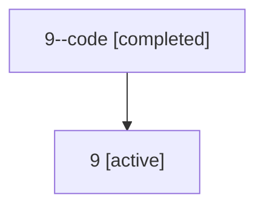

# Family: 9

Owner: `bbugyi200.athena` · Hood: `9` · Members: 2

## Lineage

The diagram is an optional enhancement; the ordered table below contains the same lineage in accessible text.

| Role | Agent | State | Model / provider | Timing | Commits | Prompt | Chat |
|---|---|---|---|---|---:|---|---|
| code | 9--code | completed | opus / claude | 2026-07-06T16:52:46.056385+00:00 | 0 | — | [Chat](../agents/bbugyi200.athena.9--code/chat.md) |
| root | 9 | active | gpt-5.5 / codex | 2026-07-06T16:50:37.216255+00:00 | 3 | [Prompt](../agents/bbugyi200.athena.9/prompt.md) | [Chat](../agents/bbugyi200.athena.9/chat.md) |
