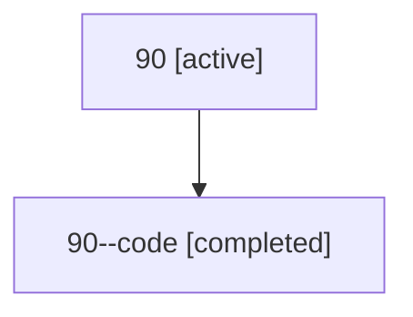

# Family: 90

Owner: `bbugyi200.athena` · Hood: `90` · Members: 2

## Lineage

The diagram is an optional enhancement; the ordered table below contains the same lineage in accessible text.

| Role | Agent | State | Model / provider | Timing | Commits | Prompt | Chat |
|---|---|---|---|---|---:|---|---|
| root | 90 | active | gpt-5.6-sol / codex | 2026-07-15T13:05:49.720050+00:00 | 1 | [Prompt](../agents/bbugyi200.athena.90/prompt.md) | [Chat](../agents/bbugyi200.athena.90/chat.md) |
| code | 90--code | completed | gpt-5.6-sol / codex | 2026-07-15T13:17:30.437861+00:00 | 0 | — | [Chat](../agents/bbugyi200.athena.90--code/chat.md) |
