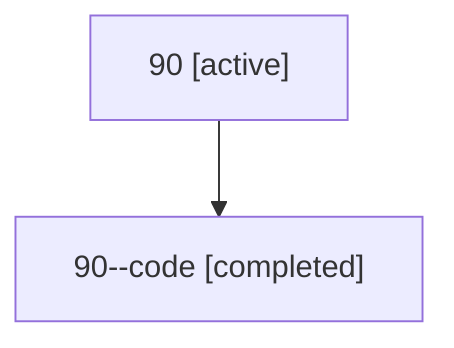

# Family: 90

[Agent Hoods](../README.md) / [bbugyi200](../users/bbugyi200/README.md) / [athena](../users/bbugyi200/machines/athena/README.md) / [90](../users/bbugyi200/machines/athena/hoods/90/README.md) / 90

Owner: `bbugyi200.athena` · Hood: `90` · Members: 2

## Lineage

The diagram is an optional enhancement; the ordered table below contains the same lineage in accessible text.

| Role | Agent | State | Model / provider | Timing | Commits | Prompt | Chat |
|---|---|---|---|---|---:|---|---|
| root | 90 | active | gpt-5.6-sol / codex | 2026-07-15T13:05:49.720050+00:00 | [1](../agents/bbugyi200.athena.90/README.md#commits) | [Prompt](../agents/bbugyi200.athena.90/prompt.md) | [Chat](../agents/bbugyi200.athena.90/chat.md) |
| code | 90--code | completed | gpt-5.6-sol / codex | 2026-07-15T13:17:30.437861+00:00 | 0 | — | [Chat](../agents/bbugyi200.athena.90--code/chat.md) |

## Commits

| Role | Repo | Commit | Subject | Committed |
|---|---|---|---|---|
| root | sase | [`bd8fe53`](https://github.com/sase-org/sase/commit/bd8fe533476acf747a7203a03fc265943e73fe8a) | test: stabilize xprompt skill highlight coverage | 2026-07-15 09:23:18 EDT |

## Neighbors

| Agent | Relation | State |
|---|---|---|
| [90.cdx](../agents/bbugyi200.athena.90.cdx/README.md) | descendant | completed |
