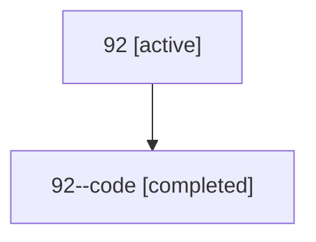

# Family: 92

[Agent Hoods](../README.md) / [bbugyi200](../users/bbugyi200/README.md) / [athena](../users/bbugyi200/machines/athena/README.md) / [92](../users/bbugyi200/machines/athena/hoods/92/README.md) / 92

Owner: `bbugyi200.athena` · Hood: `92` · Members: 2

## Lineage

The diagram is an optional enhancement; the ordered table below contains the same lineage in accessible text.

| Role | Agent | State | Model / provider | Timing | Commits | Prompt | Chat |
|---|---|---|---|---|---:|---|---|
| root | 92 | active | gpt-5.6-sol / codex | 2026-07-15T13:59:28.818607+00:00 | [3](../agents/bbugyi200.athena.92/README.md#commits) | [Prompt](../agents/bbugyi200.athena.92/prompt.md) | [Chat](../agents/bbugyi200.athena.92/chat.md) |
| code | 92--code | completed | gpt-5.6-sol / codex | 2026-07-15T14:07:00.278176+00:00 | 0 | — | [Chat](../agents/bbugyi200.athena.92--code/chat.md) |

## Commits

| Role | Repo | Commit | Subject | Committed |
|---|---|---|---|---|
| root | sase | [`49c9470`](https://github.com/sase-org/sase/commit/49c9470431d6ce6a192ee3b5db2b84ec59eef036) | chore: Add SDD prompt and plan for agents\_list\_command | 2026-06-17 07:11:45 EDT |
| root | sase | [`00dc569`](https://github.com/sase-org/sase/commit/00dc569bba2ce6e1850ebab0bd7de17cda0d664e) | feat(cli)!: rename \`agents status\` to \`agents list\` | 2026-06-17 07:43:09 EDT |
| root | sase | [`fc3fc55`](https://github.com/sase-org/sase/commit/fc3fc552c09b3b78c30fdb0765eaf02ea70af32d) | fix: normalize GitHub sidecar origins to SSH | 2026-07-15 10:28:06 EDT |

## Neighbors

| Agent | Relation | State |
|---|---|---|
| [92.f1](../agents/bbugyi200.athena.92.f1/README.md) | descendant | completed |
| [92.w0](../agents/bbugyi200.athena.92.w0/README.md) | descendant | active |
