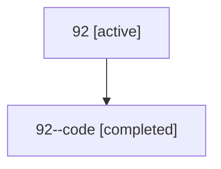

# Family: 92

Owner: `bbugyi200.athena` · Hood: `92` · Members: 2

## Lineage

The diagram is an optional enhancement; the ordered table below contains the same lineage in accessible text.

| Role | Agent | State | Model / provider | Timing | Commits | Prompt | Chat |
|---|---|---|---|---|---:|---|---|
| root | 92 | active | gpt-5.6-sol / codex | 2026-07-15T13:59:28.818607+00:00 | 3 | [Prompt](../agents/bbugyi200.athena.92/prompt.md) | [Chat](../agents/bbugyi200.athena.92/chat.md) |
| code | 92--code | completed | gpt-5.6-sol / codex | 2026-07-15T14:07:00.278176+00:00 | 0 | — | [Chat](../agents/bbugyi200.athena.92--code/chat.md) |
