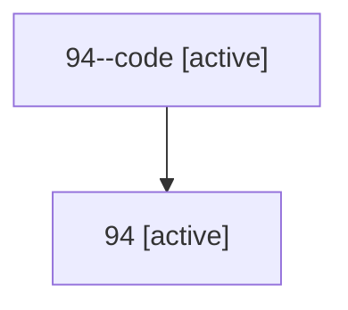

# Family: 94

Owner: `bbugyi200.athena` · Hood: `94` · Members: 2

## Lineage

The diagram is an optional enhancement; the ordered table below contains the same lineage in accessible text.

| Role | Agent | State | Model / provider | Timing | Commits | Prompt | Chat |
|---|---|---|---|---|---:|---|---|
| code | 94--code | active | gpt-5.6-sol / codex | 2026-07-15T14:52:33.612708+00:00 | 1 | — | — |
| root | 94 | active | gpt-5.6-sol / codex | 2026-07-15T14:49:16.626160+00:00 | 3 | [Prompt](../agents/bbugyi200.athena.94/prompt.md) | [Chat](../agents/bbugyi200.athena.94/chat.md) |
