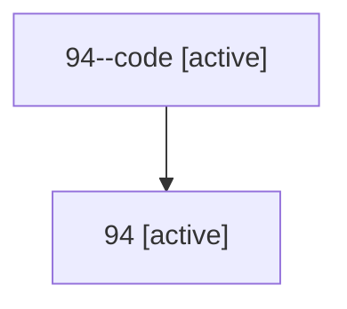

# Family: 94

[Agent Hoods](../README.md) / [bbugyi200](../users/bbugyi200/README.md) / [athena](../users/bbugyi200/machines/athena/README.md) / [94](../users/bbugyi200/machines/athena/hoods/94/README.md) / 94

Owner: `bbugyi200.athena` · Hood: `94` · Members: 2

## Lineage

The diagram is an optional enhancement; the ordered table below contains the same lineage in accessible text.

| Role | Agent | State | Model / provider | Timing | Commits | Prompt | Chat |
|---|---|---|---|---|---:|---|---|
| code | 94--code | active | gpt-5.6-sol / codex | 2026-07-15T14:52:33.612708+00:00 | 0 | — | — |
| root | 94 | active | gpt-5.6-sol / codex | 2026-07-15T14:49:16.626160+00:00 | [3](../agents/bbugyi200.athena.94/README.md#commits) | [Prompt](../agents/bbugyi200.athena.94/prompt.md) | [Chat](../agents/bbugyi200.athena.94/chat.md) |

## Commits

| Role | Repo | Commit | Subject | Committed |
|---|---|---|---|---|
| root | sase | [`ac28e8e`](https://github.com/sase-org/sase/commit/ac28e8ebd387937fd411df9aa2fefdb52a012a1b) | chore: Add SDD prompt and plan for xprompt\_metadata\_capture | 2026-06-17 07:19:19 EDT |
| root | sase | [`ecd13bf`](https://github.com/sase-org/sase/commit/ecd13bf83276677daa5d6bf4ad18dcb615a70810) | fix(xprompt): capture launch-boundary xprompt metadata for daemon agents | 2026-06-17 07:38:34 EDT |
| root | sase | [`d2157eb`](https://github.com/sase-org/sase/commit/d2157eb0e53bcf6363055a294ed15a11696665ac) | fix(init): filter batch inventory to projects | 2026-07-15 11:01:06 EDT |
