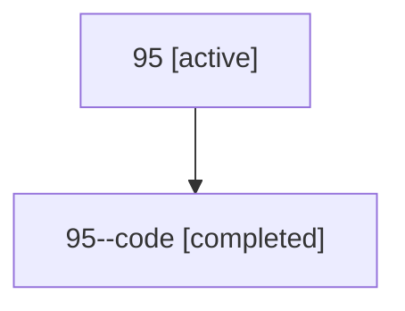

# Family: 95

[Agent Hoods](../README.md) / [bbugyi200](../users/bbugyi200/README.md) / [athena](../users/bbugyi200/machines/athena/README.md) / [95](../users/bbugyi200/machines/athena/hoods/95/README.md) / 95

Owner: `bbugyi200.athena` · Hood: `95` · Members: 2

## Lineage

The diagram is an optional enhancement; the ordered table below contains the same lineage in accessible text.

| Role | Agent | State | Model / provider | Timing | Commits | Prompt | Chat |
|---|---|---|---|---|---:|---|---|
| root | 95 | active | gpt-5.6-sol / codex | 2026-07-15T14:55:44.072474+00:00 | 0 | [Prompt](../agents/bbugyi200.athena.95/prompt.md) | [Chat](../agents/bbugyi200.athena.95/chat.md) |
| code | 95--code | completed | gpt-5.6-sol / codex | 2026-07-15T15:04:29.601025+00:00 | [1](../agents/bbugyi200.athena.95--code/README.md#commits) | — | [Chat](../agents/bbugyi200.athena.95--code/chat.md) |

## Commits

| Role | Repo | Commit | Subject | Committed |
|---|---|---|---|---|
| code | sase | [`e68ff17`](https://github.com/sase-org/sase/commit/e68ff172ddd53906806432e3f886ece2a203c7e3) | fix: clone launch sidecars from authoritative remotes | 2026-07-15 15:27:02 UTC |

## Neighbors

| Agent | Relation | State |
|---|---|---|
| [95.f0](../agents/bbugyi200.athena.95.f0/README.md) | descendant | active |
| [95.f1](../agents/bbugyi200.athena.95.f1/README.md) | descendant | active |
