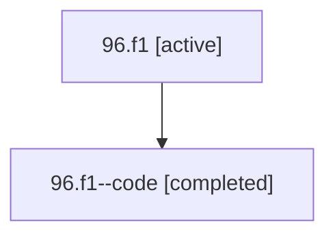

# Family: 96.f1

[Agent Hoods](../README.md) / [bbugyi200](../users/bbugyi200/README.md) / [athena](../users/bbugyi200/machines/athena/README.md) / [96](../users/bbugyi200/machines/athena/hoods/96/README.md) / 96.f1

Owner: `bbugyi200.athena` · Hood: `96` · Members: 2

## Lineage

The diagram is an optional enhancement; the ordered table below contains the same lineage in accessible text.

| Role | Agent | State | Model / provider | Timing | Commits | Prompt | Chat |
|---|---|---|---|---|---:|---|---|
| root | 96.f1 | active | gpt-5.6-sol / codex | 2026-07-15T16:06:09.078676+00:00 | 0 | [Prompt](../agents/bbugyi200.athena.96.f1/prompt.md) | [Chat](../agents/bbugyi200.athena.96.f1/chat.md) |
| code | 96.f1--code | completed | gpt-5.6-sol / codex | 2026-07-15T16:24:16.493300+00:00 | [1](../agents/bbugyi200.athena.96.f1--code/README.md#commits) | — | [Chat](../agents/bbugyi200.athena.96.f1--code/chat.md) |

## Commits

| Role | Repo | Commit | Subject | Committed |
|---|---|---|---|---|
| code | sase | [`03df1f8`](https://github.com/sase-org/sase/commit/03df1f88dabcdb8895abf5025f566c389da3b7a3) | test: tighten visual snapshot drift tolerance | 2026-07-15 12:49:46 EDT |

## Neighbors

| Agent | Relation | State |
|---|---|---|
| [96](bbugyi200.athena.96.md) (family · 2) | ancestor | active 1, completed 1 |
| [96.f0](../agents/bbugyi200.athena.96.f0/README.md) | 96 hood | active |
