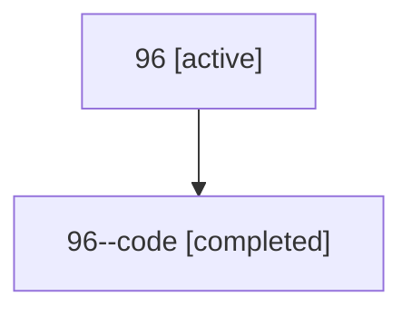

# Family: 96

Owner: `bbugyi200.athena` · Hood: `96` · Members: 2

## Lineage

The diagram is an optional enhancement; the ordered table below contains the same lineage in accessible text.

| Role | Agent | State | Model / provider | Timing | Commits | Prompt | Chat |
|---|---|---|---|---|---:|---|---|
| root | 96 | active | opus / claude | 2026-07-15T15:17:18.847499+00:00 | 1 | [Prompt](../agents/bbugyi200.athena.96/prompt.md) | [Chat](../agents/bbugyi200.athena.96/chat.md) |
| code | 96--code | completed | gpt-5.6-sol / codex | 2026-07-15T15:33:00.452914+00:00 | 1 | — | [Chat](../agents/bbugyi200.athena.96--code/chat.md) |
