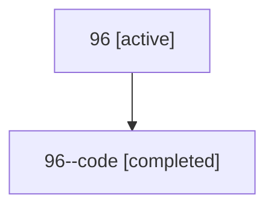

# Family: 96

[Agent Hoods](../README.md) / [bbugyi200](../users/bbugyi200/README.md) / [athena](../users/bbugyi200/machines/athena/README.md) / [96](../users/bbugyi200/machines/athena/hoods/96/README.md) / 96

Owner: `bbugyi200.athena` · Hood: `96` · Members: 2

## Lineage

The diagram is an optional enhancement; the ordered table below contains the same lineage in accessible text.

| Role | Agent | State | Model / provider | Timing | Commits | Prompt | Chat |
|---|---|---|---|---|---:|---|---|
| root | 96 | active | opus / claude | 2026-07-15T15:17:18.847499+00:00 | [1](../agents/bbugyi200.athena.96/README.md#commits) | [Prompt](../agents/bbugyi200.athena.96/prompt.md) | [Chat](../agents/bbugyi200.athena.96/chat.md) |
| code | 96--code | completed | gpt-5.6-sol / codex | 2026-07-15T15:33:00.452914+00:00 | 0 | — | [Chat](../agents/bbugyi200.athena.96--code/chat.md) |

## Commits

| Role | Repo | Commit | Subject | Committed |
|---|---|---|---|---|
| root | sase | [`5e9bfa1`](https://github.com/sase-org/sase/commit/5e9bfa1987f0b9ba998173e4e3e5e23793b10f85) | feat(ace)!: collapse focused agent panels | 2026-07-15 12:05:20 EDT |

## Neighbors

| Agent | Relation | State |
|---|---|---|
| [96.f0](../agents/bbugyi200.athena.96.f0/README.md) | descendant | active |
| [96.f1](bbugyi200.athena.96.f1.md) (family · 2) | descendant | active 1, completed 1 |
